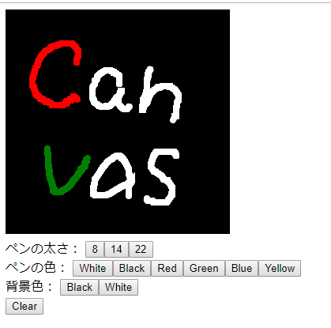

# Drawing Canvas Sample

## Overview

HTMLのCanvasにマウスのドラッグで線を描けるVue.jsのコンポーネント。

## Description

/src/DrawingCanvas.vueがCanvasのVue.jsのコンポーネントです。

## Usage

install

    npm install
    npm run serve

access

    http://localhost:8080/

## Screnshot

